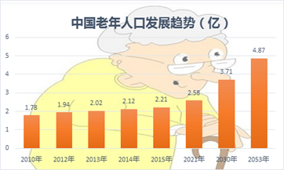
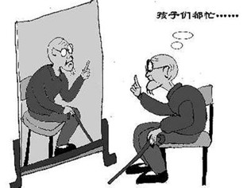
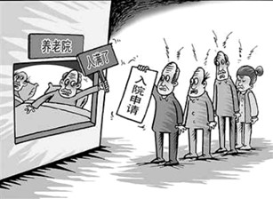

# 老龄化

关键词：

aging problem, endowment insurance, medical and health level

------

## 第一张图片

原因：

1. 生活成本上升，人们工作忙，没有时间照顾小孩，养小孩费钱，fertility rate 下降
2. 医疗卫生水平(medical and health level)进步，人均寿命延长
3. birth-control policy

结果：

1. 社会劳动力减少 (social label force)。
2. 增加企业和政府的负担 , 养老保险(endowment insurance) ，老年人更容易生病

------

## 第二张图片 -elderly people living alone

原因：

1. 子女工作忙，现代社会压力大。没有时间陪伴老人。
2. 老人觉得自己能够照顾自己，不需要和子女一起居住，也有经济能力照顾自己。

结果：

1. 老人孤单，心理健康。 -> 抑郁
2. harm the relationship between the parents and children. 因为缺乏交流，子女不理解父母的难处

------

## 第三张图片 - old people's home being overcrowded

原因：

1. 子女工作忙，社会压力大，没有时间照顾老人。
1. 养老院对于老人来说是最优的选择

结果：

1. 一部分老人没有人照料。降低社会福利。
2. 老人的心理健康。

------

### 建议

政府：enforce some regulations  or promote some aids to encourage children to keep their parents company.

媒体：expose, public service adver.

社区：招募一些志愿者去关心照料老人。

子女： 主动关心。

