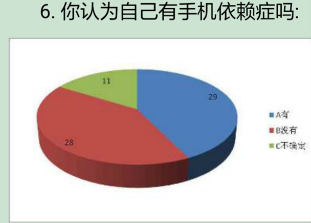
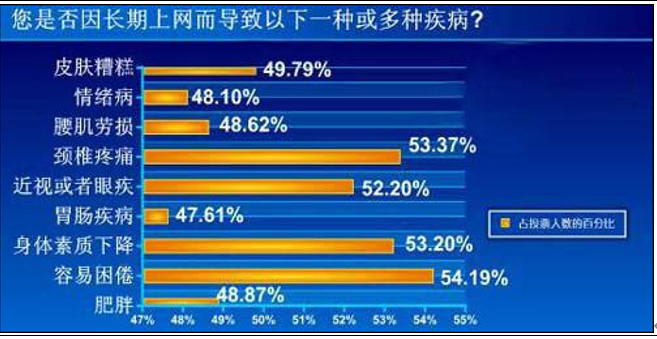
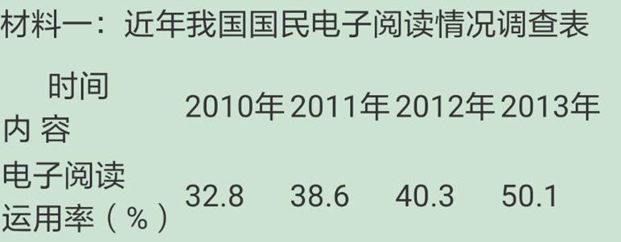

# 手机依赖

关键词

cell phone addiciton, health

------

## 第一张图片

因：

1. 方便。（和AI有点像）随时随地可以阅读； 足不出户可以点餐；online file system, like word, can improve working efficiency.
2. 帮助人们放松。escape from the reality for a while and relax themselves. Bilibili, TikTok...

果：

1. addiction.  青少年没有形成成熟的价值观，无法辨别是非 ->学volience -> have conflits, fight 
2. health. 身体各种疾病。心理，打游戏，与世隔绝，孤独，不会交流（貌似有点严重了

------

## 第二张图片

原因：

1. 学习压力大，看不完的论文，写不完的作业， 可以举个例子，被迫熬夜，给导师干活(ddl很赶，本身事情又多，只能一直看电脑) 
2. 疫情，没法出去玩，只能跟电脑玩 （皮一下很开心
3. 打游戏让人快乐

结果：

1. 视力变差 ，因为长期盯着电脑
2. 困倦和肥胖, 因为 keeping sedentary for a long time

------

## 第三张图片

原因：

1. kindle, ipad这种portable device， 它们很轻，人们可以随身携带，read anywhere & anytime。举个例子：暑假实习的时候，在subway上read novels (虽然事实上并没有
1. 现在网络小说多了，因为网上写作很方便，人们有更多的选择，eailser to find the novels or books they want to read

结果：

1. 人们会依赖手机，addiction，因为小说太好看了。学生 -> stay up late to read novels -> sleepy during the class-> reduce study efficiency -> get low grades & can't understand the knowledge -> harmful for future development
2. 有害健康。staring at the screen for a long time，和上一张图一样。脱离现实，和第一张图片一样。

------

## 建议

政府：enforce some regulations to restrict the time of teenagers' playing computer games；punish the businessmen who spread negative values or false values

媒体：expose this phenomenon, encourage people to go outside instead of keep sedentary. 

学校：teach the teens to be self-disciplined

个人：利用网络的优点