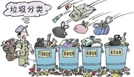
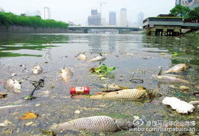
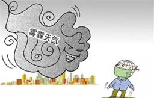

# 环境保护

关键词

garbage classification, pollution, haze

------

### 第一张图 垃圾分类

原因：

1. 人们缺乏垃圾分类相关的知识 lack of knowledge ，举例 recyclables, recyclables, harmful trash
2. 政府缺乏相关的监管  there is not sufficient supervision or regulations

结果：

1. 分错类。 people mis classify the garbage -> the classification policy doesn't make sense -> cause trouble to classification workers因为需要时间去重新分类
2. 传播疾病。医疗垃圾（medical waste），spread the disease

------

### 第二张图： 污水

原因：

1.  industrial pollution/ oil spill

结果：

1.  农产品受害 ->  农民减产 ->收入减少
2. drinking water -> 危害人们的健康 -> 生病 (certain types of cancers)
3. wildlife -> 没地住了 -> even extinction

------

### 第三张图：雾霾天气

原因：

1. forest fires in the region
2. emission gas from private cars

结果：

1. people's health get worse , 特别是老年人 & those who has pre-existing chronic heart or lung disease
2. 环境 uncomfortable -> 影响人们的情绪 -> 心理健康
3. 出行不方便， 司机看不见路 -> 容易出车祸

------

### 建议

1. 公司。firms should use natural cleaning products instead of toxic ones
2. 政府。 第一点：模板-enforce the laws more strictly, give more punishment to the firms or individuals who obey the laws. 第二点： plant more trees in the city
3. 社区。 做一些宣传 (publicity)让更多的人get involved，例如，人们看到别人垃圾分类他也会垃圾分类。
4. 个人。做好垃圾分类 (dispose the waste properly)， get involved at school & work voluntarily.