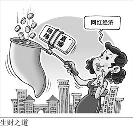

# 网红直播

关键词：

live cast celebrity,  fierce competition(激烈的竞争), show a warning sign(警示)

------

## 第一张图片

原因：

1. 互联网的发展为商家的销售提供了新的platform
2. desire for businessmen to earn money
3. 人们经常用手机，直播方式对于人们购物更加方便

结果：

1. 商品质量与描述不符 incompatible -> conflict between retailer & customers -> 顾客退货，双方都是损失
2. 一些不良商家(fraudulent retailers)骗钱 -> 造成经济损失

------

## 第二张图片

原因：

1. 青少年没有成熟的价值观，没有辨别是非的能力
2. 政府没有sufficient and strong regulations 

结果：

1. 被骗，给家庭带来financial loss
2. 青少年耽误学业 addicted

------

## 第三张图片

原因：

1. 互联网发展，为商家提供了机会
2. 成本低，容易赚钱，商家的逐利心理

结果：

1. 竞争更加激烈。顾客多渠道购买商品。
2. the quality of the products in the whole market in mixed -> unfavorable shopping experience
3. 被骗

------

## 建议

政府：enforce the regulation， avoid  people being cheated, regulate the live cast market

媒体：expose 

学校：教育学生不要沉迷网络直播

个人：self-discipline

主播：提升职业道德 （improve working ethic），传播正确的价值观(broadcast/spread right value)