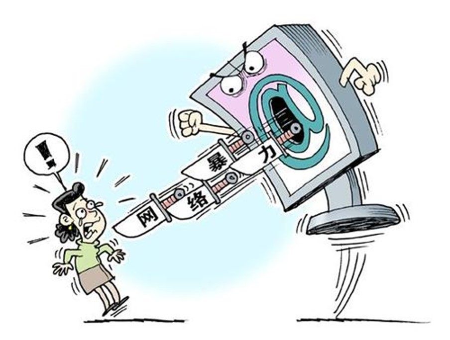

# 网络信息安全

关键词：

privacy, informaiton, **Cyber violence**, rumor, offensive, a double-edged sword

------

## 第一张图片

原因：

1. 商家。 desire to earn profit
2. 个人。保护意识不强， 上传含个人信息的照片。
3. 政府。没有足够的监管。

结果:

1. 被骗。finacial loss
2. 安全。address information is leaked
3. 商家 -> 没有惩罚 -> 窃取更多的隐私 -> 恶性循环 （vicious circle）

------

## 第二张图片

原因：

1. 政府。缺乏相应的管理。人们不用对自己说的话负责任。
2. 压力大，负面情绪多(release their pressure and emtion in this way)，见不得别人好。

结果：

1. 心理健康受损 -> depression -> reduce social welfare
2. 传播错误的价值观，青少年容易受影响。

------

## 第三张图片

原因：

1. 政府缺乏监管。
2. 人们是容易受别人的影响，缺乏辨别是否的能力。

结果：

1. hard for people to believe the news from the Internet, 一些重要的需要传播的信息无法传播出去，比如老人在家里生病了需要救助。
2. 和图二一样，传播错误的价值观。

------

## 建议

政府：enforce relative laws and regulations more strictly. Punish those who gather and collect others' info. without others' permission.

媒体：expose. post some ways about how to avoid being cheated 

学校：teach students knowledge about how to protect themselves when they are surfing the Internet.

个人：enhance the awareness of self-protection. 