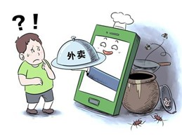
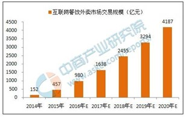
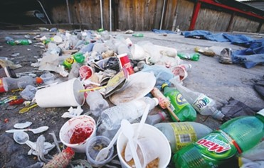

# 外卖

关键词：

take out, one-off chopsticks

------

## 第一张图片

原因：

1. 商家逐利。
2. 政府监管不当。

结果：

1. 人们吃了容易生病。
2. 没有监管 -> 商家继续使用不干净的raw material -> vicious circle

------

## 第二张图片

好处：

1. 方便。
2. 高效。节约时间

坏处：

1. 食品安全。
2. 浪费。

------

## 第三张图片

外卖浪费。

原因：

1. 人们lack the awareness of saving food
2. 政府监管不力。

结果：

1. 环境污染。 plastic bottles, one-off chopsticks
2. 对动物造成危害。 

------

## 建议

政府：enforce the regulations and food safety laws more strictly. punish the businessmen who contributes a lot to the food satety problems more. 

媒体：expose this phenomenon

学校：educate the students don't waste food,  order what they need

个人：raise the awareness, influence the people around us so that more people will be involved to reduce waste and protect the environment.